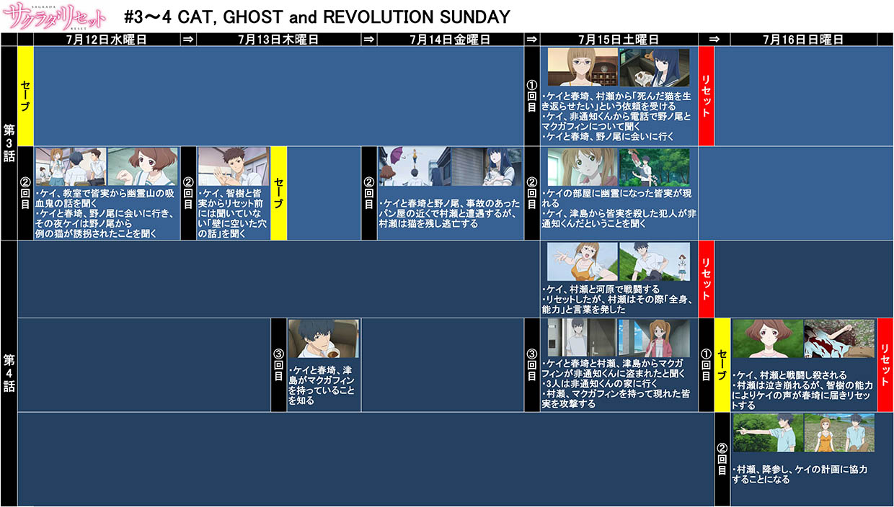
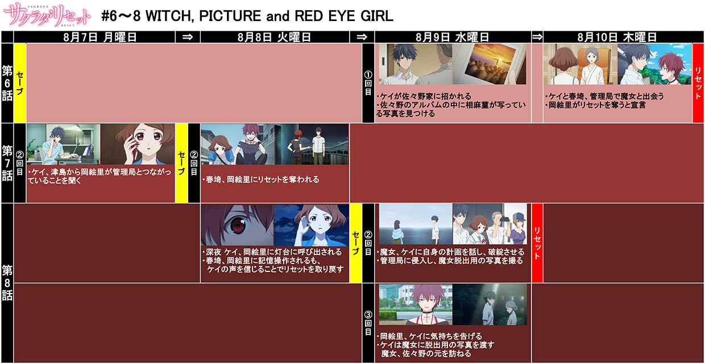
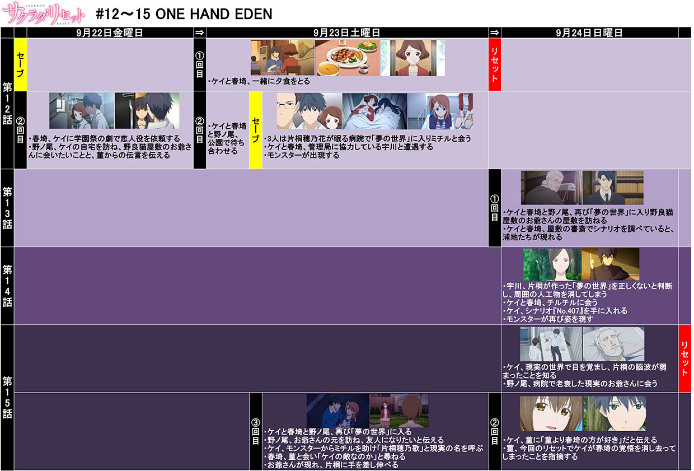

## 河野裕粉丝罕至之处  
**··河野裕作品相关信息部落格（管理员2015年后没有更新）:**[http://sakuradafan.web.fc2.com/works.html](http://sakuradafan.web.fc2.com/works.html)
 
**··咲良田时间线**
（相信不用汉化也都能看得懂）
 
 
 
<table border cellpadding=2>
	<tr bgcolor="#dddddd">
		<td align=center colspan=4><b>既刊一覧</b></td>
		<tr bgcolor="#eeeeff">
		<td align=center>シリーズ</td><td align=center>作品名</td><td align=center>レーベル</td><td align=center>発売日</td>
	</tr>

	<tr>
		<td bgcolor="#ddffee" rowspan=8 align=center>サクラダリセット (全七巻/イラスト：椎名優)</td>
	</tr>
	<tr bgcolor="#ddffee">
		<td > サクラダリセット CAT,GHOST and REVOLUTION SUNDAY</td><td>角川スニーカー文庫</td><td>2009年06月01日</td>
	</tr>
	<tr bgcolor="#ddffee">
		<td> サクラダリセット2 WHICH,PICTURE and RED EYE GIRL</td><td>角川スニーカー文庫</td><td>2010年03月01日</td>
	</tr>
	<tr bgcolor="#ddffee">
		<td> サクラダリセット3 MEMORY in CHILDREN</td><td>角川スニーカー文庫</td><td>2010年09月01日</td>
	</tr>
	<tr bgcolor="#ddffee">
		<td> サクラダリセット4 GOODBYE in not EASY WORD to SAY</td><td>角川スニーカー文庫</td><td>2010年12月01日</td>
	</tr>
	<tr bgcolor="#ddffee">
		<td> サクラダリセット5 ONE HAND EDEN</td><td>角川スニーカー文庫</td><td>2011年05月01日</td>
	</tr>
	<tr bgcolor="#ddffee">
		<td> サクラダリセット6 BOY,GIRL and --</td><td>角川スニーカー文庫</td><td>2011年12月01日</td>
	</tr>
	<tr bgcolor="#ddffee">
		<td> サクラダリセット7 BOY,GIRL and the STORY of SAGRADA</td><td>角川スニーカー文庫</td><td>2012年04月01日</td>
	</tr>

	<tr >
	<tr>
		<td bgcolor="#ffffcc" rowspan=5 align=center>つれづれ、北野坂探偵舎 (既刊4巻)</td>
	</tr>
	<tr bgcolor="#ffffcc">
		<td>つれづれ、北野坂探偵舎 心理描写が足りてない</td><td>角川文庫</td><td>2013年09月25日</td>
	</tr>
	<tr bgcolor="#ffffcc">
		<td>つれづれ、北野坂探偵舎 著者には書けない物語</td><td>角川文庫</td><td>2013年12月25日</td>
	</tr>
	<tr bgcolor="#ffffcc">
		<td>つれづれ、北野坂探偵舎　ゴーストフィクション</td><td>角川文庫</td><td>2014年03月25日</td>
	</tr>
	<tr bgcolor="#ffffcc">
		<td>つれづれ、北野坂探偵舎　感情を売る非情な職業</td><td>角川文庫</td><td>2015年03月25日</td>
	</tr>

	<tr bgcolor="#b0c4de">
		<td rowspan=3 align=center>階段島 (既刊2巻/イラスト:越島はぐ)</td>
	</tr>
	<tr bgcolor="#b0c4de">
		<td>いなくなれ、群青</td><td>新潮文庫nex</td><td>2014年08月28日</td>
	</tr>
	<tr bgcolor="#b0c4de">
		<td>その白さえ嘘だとしても</td><td>新潮文庫nex</td><td>2015年05月28日</td>
	</tr>

	<tr bgcolor="#fffffff">
		<td align=center rowspan=3 align=center>ノンシリーズ</td>
	</tr>
	<tr>
		<td>ベイビー、グッドモーニング(イラスト：椎名優)</td><td>角川スニーカー文庫</td><td>2012年04月01日</td>
	</tr>
	</tr>
		<td>bell</td><td></td><td>2014年12月20日</td>
	</tr>

	<tr bgcolor="#dddddd">
		<td align=center colspan=4><b>雑誌掲載</b></td>
	</tr>
	<tr bgcolor="#eeeeff">
		<td align=center>シリーズ</td><td align=center>作品名</td><td align=center>掲載誌</td><td align=center>掲載号</td>
	</tr>

	<tr>
		<td  bgcolor="#ddffee" rowspan=5 align=center>サクラダリセット</td>
	</tr>
	<tr bgcolor="#ddffee">
		<td>月の砂を採りに行った少年の話</td> <td>ザ・スニーカー</td> <td>2010年04月号</td>
	</tr>
	<tr bgcolor="#ddffee">
		<td>ある日の春埼さん≪お見舞い編≫</td> <td>ザ・スニーカー</td> <td>2010年08月号</td>
	</tr>
	<tr bgcolor="#ddffee">
		<td>ビー玉世界とキャンディ・レジスト</td> <td>ザ・スニーカー</td> <td>2010年10月号</td>
	</tr>
	<tr bgcolor="#ddffee">
		<td>ある日の春埼さん≪友達作り編≫</td> <td>ザ・スニーカー</td> <td>2010年10月号</td>
	</tr>

	<tr>
		<td bgcolor="#ffffcc" rowspan=4 align=center>つれづれ、北野坂探偵舎</td>
	</tr>
	<tr bgcolor="#ffffcc">
		<td>第一話 本を探す幽霊の誤謬</td> <td>小説屋Sari-Sari</td> <td>2013年07月号</td>
	</tr>
	<tr bgcolor="#ffffcc">
		<td>第二話 迷子のリドル</td> <td>小説屋Sari-Sari</td> <td>2013年08月号</td>
	</tr>
	<tr bgcolor="#ffffcc">
		<td>第三話 心理描写が足りてない</td> <td>小説屋Sari-Sari</td> <td>2013年09月号</td>

	<tr>
		<td rowspan=3 bgcolor="#ffffff" align=center>ノンシリーズ</td>
	</tr>
	<tr bgcolor="#ffffff">
		<td>ホワイトパズル</td> <td>ザ・スニーカー文庫</td> <td>2009年06月号</td>
	</tr>
	<tr bgcolor="#ffffff">
		<td>八月一日〇時十八分〇八秒</td> <td>ザ・スニーカー</td> <td>2009年08月号</td>
	</tr>

	<tr bgcolor="#dddddd">
		<td align=center colspan=4><b>その他</b></td>
	</tr>

	<tr bgcolor="#eeeeff">
		<td align=center>シリーズ</td><td align=center>作品名</td><td align=center>掲載元</td><td align=center>掲載日</td>
	</tr>

	<tr>
		<td  bgcolor="#ddffee" rowspan=3 align=center>サクラダリセット</td>
	</tr>
	<tr  bgcolor="#ddffee">
		<td>ある日の春埼圧縮版 ～世界崩壊編～</td> <td>マチアソビvol.6</td> <td></td>
	</tr>
	<tr  bgcolor="#ddffee">
		<td>ある日の春埼さん圧縮版 ～どちらかの夢～</td> <td>ザ・スニーカーWEB</td> <td>2011年06月27日</td>
	</tr>

	<tr>
		<td bgcolor="#ffffff" rowspan=5 align=center>ノンシリーズ</td>
	</tr>
	<tr bgcolor="#ffffff">
		<td>ベイビー、グッドモーニング グンナイ、ダディ――死神のスタンス</td> <td>ザ・スニーカーWEB</td> <td>2012年03月26日</td>
	</tr>
	<tr bgcolor="#ffffff">
		<td>シリアルバレッド・オイタナジー</td> <td>WEB「小説家になろう」</td> <td>2013年02月26日</td>
	</tr>
	<tr bgcolor="#ffffff">
		<td>阿波圏：徳島新聞朝刊・文化欄連載コラム</td> <td>徳島新聞</td> <td>2013年04月12日～2013年12月20日</td>
	</tr>
	<tr bgcolor="#ffffff">
		<td>bell <td>WEB「3D小説」</td> <td>2014年夏</td>
	</tr>

	<tr bgcolor="#dddddd">
		<td align=center colspan=4><b>関連作品</b></td>
	</tr>

	<tr bgcolor="#eeeeff">
		<td align=center>シリーズ</td><td align=center>作品名</td><td align=center>レーベル</td><td align=center>発売日</td>
	</tr>

	<tr>
		<td  bgcolor="#ddffee" rowspan=3 align=center>コミック サクラダリセット (全2巻/著者：吉原雅彦)</td>
	</tr>
	<tr bgcolor="#ddffee">
		<td>サクラダリセット(1) CAT,GHOST and REVOLUTION SUNDAY</td> <td>角川コミックス</td> <td>2011年11年22日</td>
	</tr>
	<tr bgcolor="#ddffee">
		<td>サクラダリセット(2) CAT,GHOST and REVOLUTION SUNDAY</td> <td>角川コミックス</td> <td>2011年11年22日</td>
	</tr>

	<tr bgcolor="#ffffcc">
		<td rowspan=2 align=center>コミック つれづれ、北野坂探偵舎 (著者：ヒノモト円時)</td>
	<tr bgcolor="#ffffcc">
		<td>つれづれ、北野坂探偵舎</td> <td>コミックビーズログ</td> <td>2015年06月01日</td>
	</tr>

</table>

